# Verify — Entity Relationship Diagram

Schema of record: [backend/db/migrations/0001_init.sql](../backend/db/migrations/0001_init.sql).
Row Level Security: [0002_rls.sql](../backend/db/migrations/0002_rls.sql).

The Mermaid block below renders directly on GitHub — no image to regenerate
whenever a column changes.

```mermaid
erDiagram
    AUTH_USERS ||--|| PROFILES : "1:1 (Supabase Auth)"
    ORGANIZATIONS ||--o{ PROFILES : employs
    ORGANIZATIONS ||--o{ COURSES : offers
    ORGANIZATIONS ||--o{ CERTIFICATES : issues
    ORGANIZATIONS ||--o{ AUDIT_EVENTS : "scoped to"
    PROFILES ||--o{ CERTIFICATES : "issued_by"
    PROFILES ||--o{ CERTIFICATES : "held_by"
    PROFILES ||--o{ AUDIT_EVENTS : "acted"
    COURSES ||--o{ CERTIFICATES : "referenced by"
    CERTIFICATES ||--o{ CERTIFICATE_HASHES : "on-chain records"
    CERTIFICATES ||--o{ CLAIM_TOKENS : "claim links"
    CERTIFICATES ||--o{ VERIFICATION_LOGS : "verified via"
    CERTIFICATES ||--o{ EXPIRY_NOTIFICATIONS : "notified about"

    AUTH_USERS {
        uuid id PK "managed by Supabase Auth"
        text email
        jsonb app_metadata "role + organization_id — backend-writable ONLY"
        jsonb user_metadata "user-writable — display labels only, never authz"
    }

    PROFILES {
        uuid id PK,FK "→ auth.users(id) ON DELETE CASCADE"
        citext email UK
        text full_name
        user_role role "admin | issuer | holder — SOURCE OF TRUTH"
        uuid organization_id FK "NULL for holders/admins; required for issuers"
        account_status status "active | deactivated"
        boolean profile_is_public "default TRUE (FR-HOLD-04)"
    }

    ORGANIZATIONS {
        uuid id PK
        text name
        text slug UK
        org_type type "university | bootcamp | professional-body | event"
        text website
        text wallet_address "recorded, not used to sign (one platform relayer)"
        org_status status "active | suspended"
        boolean accredited "drives the public registry (FR-REG-01)"
        date joined_at
    }

    COURSES {
        uuid id PK
        uuid organization_id FK
        text name "UNIQUE per org — makes POST /api/courses idempotent"
        uuid created_by FK
    }

    CERTIFICATES {
        uuid id PK "the PUBLIC cert ID in /verify/[certId] — random, not sequential (NFR-SEC-04)"
        uuid organization_id FK
        uuid issuer_id FK
        uuid holder_id FK "NULL until claimed"
        text student_name "PII — off-chain only"
        citext student_email "PII — off-chain only, NOT hashed"
        text course_name "TEXT SNAPSHOT — the hash covers this exact string"
        uuid course_id FK "nullable convenience link"
        date completion_date
        date expiry_date "NULL = never"
        claim_state claim_state "unclaimed | claimed — ownership only, NOT display status"
        timestamptz revoked_at "NULL = not revoked"
        boolean is_hidden "FR-HOLD-06 — hides from profile, still verifiable (FR-HOLD-07)"
    }

    CERTIFICATE_HASHES {
        uuid id PK
        uuid certificate_id FK
        text hash UK "0x + 64 hex = the bytes32 on Polygon"
        integer hash_version "which canonical recipe produced it"
        bigint expires_at_unix "0 = never; must equal the expiry inside the hash"
        text issue_tx_hash
        text revoke_tx_hash
        timestamptz chain_issued_at "block timestamp shown on the verify page"
        chain_status chain_status "pending | confirmed | failed"
        boolean is_current "exactly one TRUE per certificate (partial unique index)"
    }

    CLAIM_TOKENS {
        uuid id PK
        uuid certificate_id FK
        text token_hash UK "SHA-256 of the token — the token itself is NEVER stored (T-02)"
        timestamptz expires_at "issued_at + 7 days (FR-AUTH-03)"
        timestamptz used_at "NULL = unused; set atomically to burn (FR-CLAIM-04)"
        citext sent_to
    }

    VERIFICATION_LOGS {
        bigserial id PK
        uuid certificate_id FK "NULL when nothing matched"
        text queried_id "kept even on a miss — the enumeration signal (T-05)"
        verify_result result
        text ip_hash "hashed, not stored — an IP is personal data"
        text user_agent
    }

    AUDIT_EVENTS {
        uuid id PK
        uuid actor_id FK "ON DELETE SET NULL — deleting a user must not erase the trail"
        citext actor_email "denormalised so the row survives the account"
        audit_action action
        text target_label
        uuid organization_id FK
        jsonb metadata
    }

    EXPIRY_NOTIFICATIONS {
        uuid id PK
        uuid certificate_id FK
        text kind "'60_day'"
        timestamptz sent_at
    }
```

## Five decisions the diagram does not explain on its own

**There is no `status` column on `certificates`.** Display status is derived on
every read from `claim_state`, `revoked_at` and `expiry_date`
([src/lib/derivedStatus.js](../backend/src/lib/derivedStatus.js)). A stored
status would be wrong the day after a certificate expires, until some job caught
up. It also has to be derived because the frontend uses two incompatible
vocabularies for it — `valid|revoked|expired|unclaimed` in the issuer table,
`verified|invalid|revoked|expired` on the verify page — and neither matches
what is worth storing.

**`certificates.course_name` is a text snapshot, not just a foreign key.** The
on-chain hash covers that exact string. If the course name were only a `courses`
reference, an institution renaming a course would silently invalidate every
certificate already issued for it.

**Hashes live in their own table.** FR-MGMT-04 "edit" is really
revoke-then-reissue: the fields change, so the hash changes, so a new on-chain
record is created. But the certificate's UUID must stay the same, because QR
codes and shared links are already in circulation. One certificate therefore
owns a history of hashes, exactly one of which `is_current` — enforced by a
partial unique index rather than by application code.

**`student_email` is never hashed.** It is mutable contact data, not part of the
credential claim. Hashing it would mean correcting a typo'd address required a
full on-chain revoke and reissue.

**Only a token's SHA-256 is stored.** A claim token is the sole credential for
taking ownership of a certificate (T-02). A database leak must not hand an
attacker working claim links, so `claim_tokens.token_hash` holds the digest and
the token exists in plaintext only in the email that was sent.

## Cardinality notes

- `profiles` is 1:1 with `auth.users` and cascades on delete — deleting the auth
  user removes the profile, but `certificates.holder_id` is `ON DELETE SET NULL`,
  so certificates survive a holder deleting their account.
- `organizations` → `certificates` is `ON DELETE RESTRICT`. An organization with
  issued certificates cannot be deleted, only suspended: the certificates must
  remain verifiable regardless of the institution's current standing.
- `claim_tokens` has a partial unique index on `(certificate_id) WHERE used_at IS
  NULL`, so re-sending a claim email invalidates the previous link instead of
  leaving two valid ways in.
