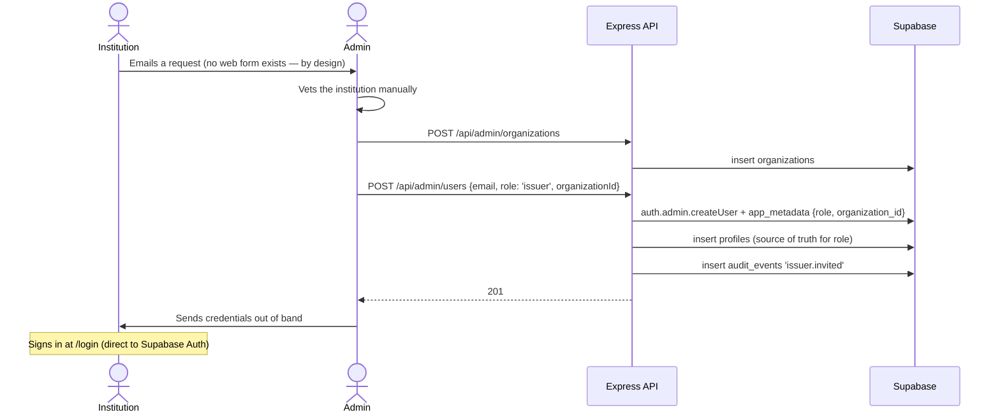
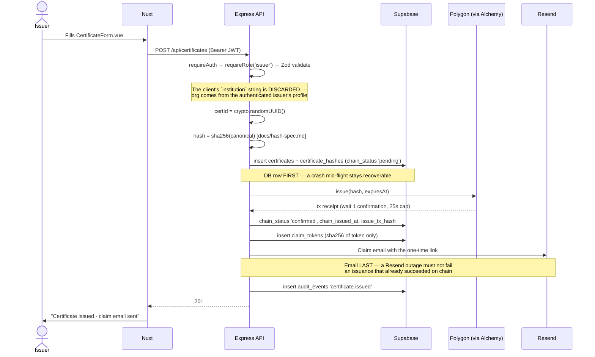
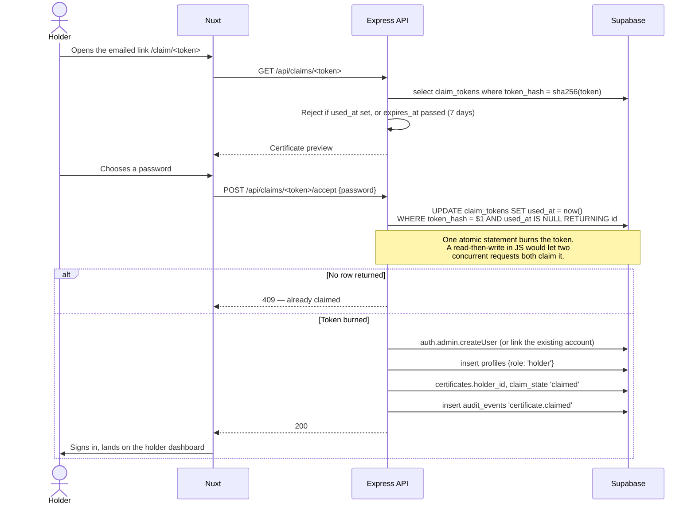
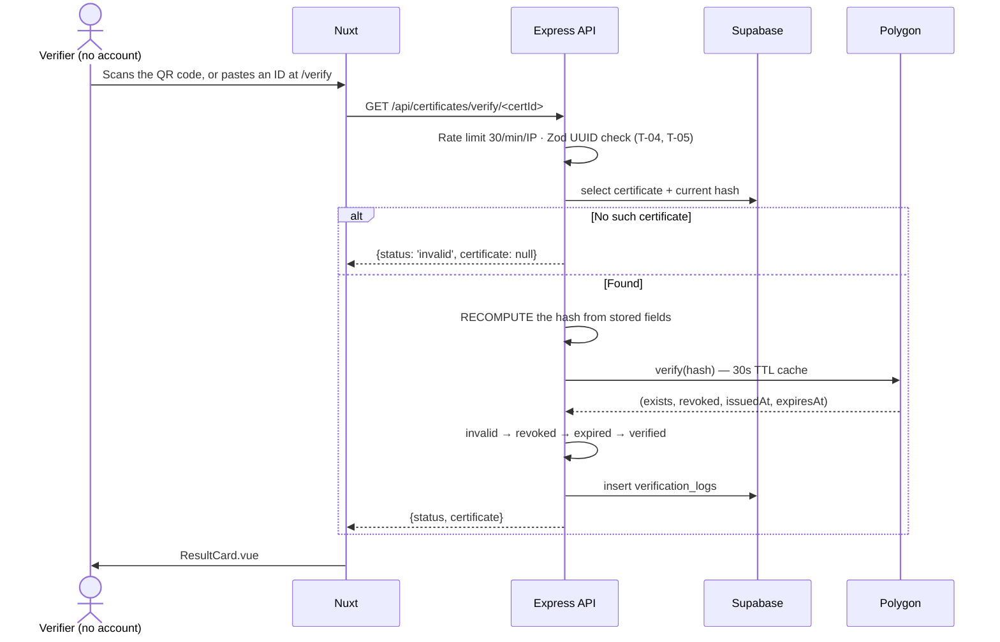

# Verify — user flows

Five flows, in the order a certificate lives through them. Mermaid renders on
GitHub.

Roles: **Issuer** (institution), **Holder** (student), **Verifier** (employer, no
account), **Admin** (platform team).

---

## 1. Onboarding an institution (FR-INST-01..03, T-09)

Self-registration is deliberately impossible. An unvetted institution issuing
credentials would undermine every certificate on the platform, so the only path
to an issuer account runs through a human decision.



Admin marks the organization `accredited` to list it publicly on the landing
page (FR-REG-01) — separate from `status`, so an org can be active but not yet
advertised.

---

## 2. Issuing a certificate (FR-ISSUE-01..07)



On a confirmation timeout the row stays `pending` with its tx hash and
`jobs/reconcilePendingTx.js` finishes it — the API never lies about state or
hangs past 25 seconds.

FR-ISSUE-07 (verifiable before the holder claims) needs no extra work:
verification never consults `claim_state`.

---

## 3. Claiming (FR-CLAIM-01..04, T-02)



A holder receiving a second certificate already has an account, so that branch
links rather than creates — after checking the address matches the one the
certificate was issued to.

---

## 4. Verifying (FR-VERIFY-01..05) — the flow that has to be right



Three things this flow gets right on purpose:

- **The hash is recomputed, never read back.** Comparing a stored hash to itself
  would always match. Recomputing from the current field values is what makes a
  tampered database row detectable — the whole product claim.
- **Integrity outranks everything.** If the hash does not match, the row is
  untrustworthy, so its revocation and expiry fields mean nothing: the answer is
  `invalid`.
- **An RPC outage is a 503, never `invalid`.** Telling an employer a genuine
  certificate is fake because Alchemy was briefly down is far worse than
  admitting the service is unavailable.

Privacy flags are ignored here: a hidden certificate stays verifiable by direct
URL (FR-HOLD-07).

---

## 5. Revoking, editing, expiring (FR-MGMT-03/04, FR-EXP-01..04)

```mermaid
sequenceDiagram
    actor Issuer
    participant API as Express API
    participant SB as Supabase
    participant BC as Polygon
    participant Cron as node-cron

    rect rgb(245,240,240)
    Note over Issuer,BC: Revoke
    Issuer->>API: POST /api/certificates/:id/revoke
    API->>BC: revoke(hash)
    API->>SB: revoked_at, revoke_reason
    API->>API: Drop the cached chain result → visible within seconds
    API->>SB: audit_events 'certificate.revoked'
    end

    rect rgb(240,243,245)
    Note over Issuer,BC: Edit = revoke + reissue, same certificate UUID
    Issuer->>API: PUT /api/certificates/:id
    API->>BC: revoke(oldHash)
    API->>API: newHash from the updated fields
    API->>BC: issue(newHash, expiresAt)
    API->>SB: old hash is_current = false; insert the new one
    Note over API,SB: The UUID never changes — QR codes<br/>already printed keep working
    API->>SB: audit_events 'certificate.reissued'
    end

    rect rgb(242,245,240)
    Note over Cron,SB: Expiry
    Cron->>SB: Daily 02:00 UTC — expiry_date = today + 60
    Cron->>SB: insert expiry_notifications (unique per cert+kind)
    Note over Cron,SB: The unique constraint IS the idempotency guard —<br/>a restart cannot double-email
    Cron->>Cron: Send via Resend
    end
```

Expiry itself needs no job: status is derived on read, so a certificate becomes
`expired` the day after its expiry date automatically. The job only sends the
60-day warning (FR-EXP-03).

---

## Privacy controls (FR-HOLD-04..07)

The distinction that matters, and the one worth a test of its own:

| Surface | Respects `is_hidden` / `profile_is_public`? |
| --- | --- |
| Holder's public profile page | **Yes** — hidden certificates are absent |
| `GET /api/certificates/verify/:certId` | **No** — always verifiable |
| QR code / direct link | **No** — always resolves |

Privacy here means "not listed", not "not verifiable". A holder can keep a
credential off their public profile while still handing a specific employer a
working link — and an employer who has a link can always check it, which is what
makes the platform trustworthy to both sides.
